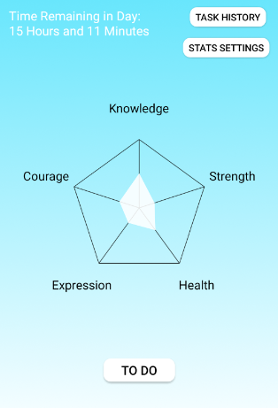

# MyLifeStats
A daily task planner gamification app that lets you visualize your everyday tasks as part of a video game. Choose real life stats you want to improve on, and gain points towards them by completing self-defined tasks.

This app also lets you take pictures when you complete tasks as proof of completion. The task history can later be shared with accountability buddies.

## List of Current Features (More to be added)
### My Stats
- Add and edit personal stat names
- May adjust the max value of stats and the scaling for individual stats
- App changes theme at morning, evening and night and reminds you of the time left in the day
- Press "To Do" to start the day's tasks

### To-Do List
- Create new tasks quickly and easily with customizable rewards, penalties, deadlines and repeat intervals
- When completing a task, a photo may be taken as proof of completion which will be recorded in the task history
- Completing a task will reward stat points based on the difficulty of the task
- Missing a deadline for a task may subtract stat points based on the importance of the task
- Option to provide an explanation to cancel tasks early without stat penalty
- An undo button will appear when you make any changes to the to-do list

### Task History
- The task history records your completed, cancelled and missed tasks
- It can be shared with accountability buddies with an option to filter by date and keep certain tasks private

### [Link to the APK File](https://drive.google.com/file/d/1_Duwxvquy771WhmDOKegpYu_FFuz9MG9/view?usp=sharing)
